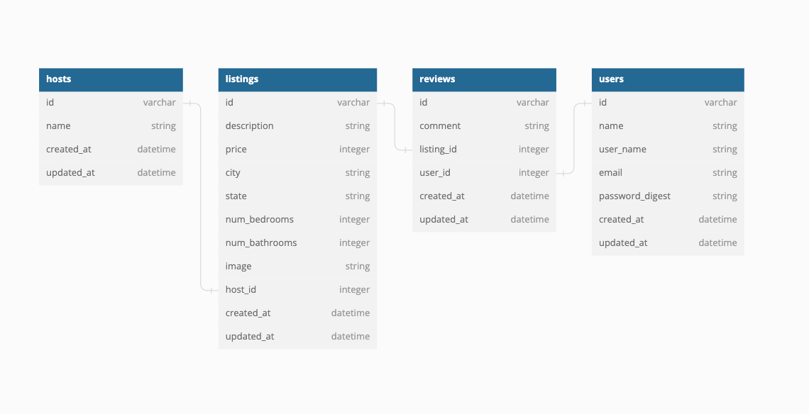
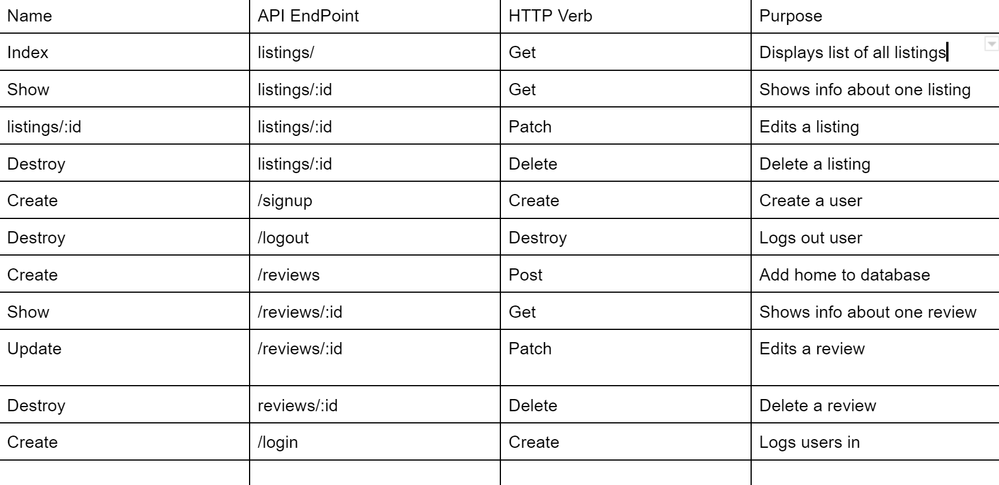

# Stay Vibes
## About The Project
The inspiration behind this project was to recreate the renowned Airbnb app and leverage our skills in developing an application using React and Rails. This app provides a fun platform for renting and listing unique homes across the country. On the website, users will be able to:

* Sign up and create a profile
* View all listings and their associated reviews
* Delete their own reviews
* Save their favorite homes to a "favorites" page
* Edit their reviews

## Built With:
* React 
* Ruby on Rails 
* Bootstrap
* Chakra UI
* Postgres 


## Getting Started 

Associations Diagram:



API Endpoints:




## Getting Started

Clone the repo:
   ```sh
   git clone https://github.com/wendy174/Stay-Vibes.git
   ```

### Back End Setup 

Install the dependencies, create a database, migrate, seed your file, then start the server 
*You only need to run these commands when first setting up the application. 

```console
$ bundle install 
$ rails db:create 
$ rails db:migrate 
$ rails db:seed
$ rails server
```

### Front End Setup 

In another terminal run these commands to setup the frontend. 
```
npm install
npm start
```


## Authors: 

 * Wendy Yeung:  https://github.com/wendy174
 * Klajdo Qasolli: https://github.com/KlajdoQ
 * Walter Clark: https://github.com/Waltl33
 * Patrick Carrera: https://github.com/patricklcarrera

## Contributing

Contributions are what make the open source community such an amazing place to learn, inspire, and create. Any contributions you make are **greatly appreciated**.

If you have a suggestion that would make this better, please fork the repo and create a pull request. You can also simply open an issue with the tag "enhancement".
Don't forget to give the project a star! Thanks again!

1. Fork the Project
2. Create your Feature Branch (`git checkout -b feature/AmazingFeature`)
3. Commit your Changes (`git commit -m 'Add some AmazingFeature'`)
4. Push to the Branch (`git push origin feature/AmazingFeature`)
5. Open a Pull Request

