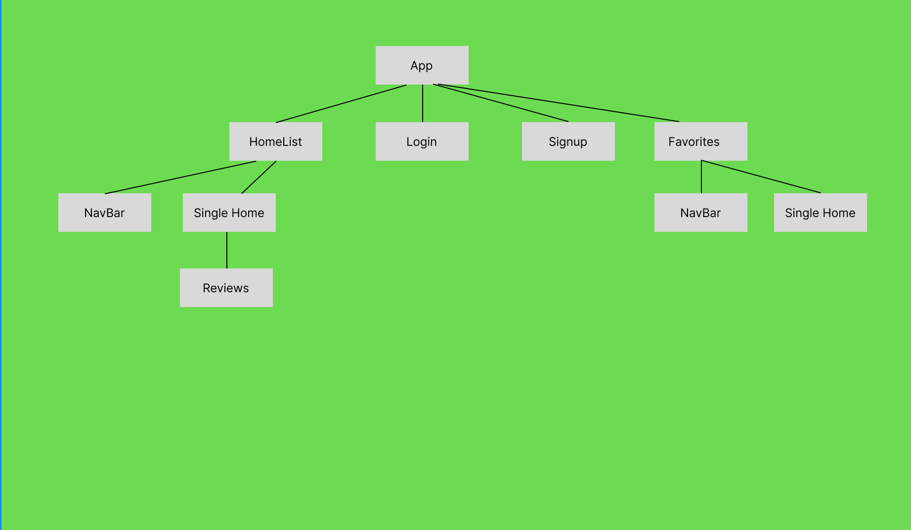

# Stay Vibes

The inspiration of this project design was to recreate the famous app Airbnb and utilize our abilities in making an app with React and Rails. This is a fun app to rent and list homes around the country that are unique in their own ways. In the website users will be able to:
* Signup with a profile
* View all the listings, and reviews that are associated with it
* Delete reviews
* Save homes they favorite to a "favorites" page
* Edit their reviews

## Technologies

### Frontend

Using React, Stay Vibes is a single-page application and App.js as the main parent component

React Component Tree:



To create the multi-page single-app , we implemented React router.  Redirections were done with the ```useNavigate``` hook.

Styling includes React-Bootstrap, Chakra UI, and React-Burger Menu along with some custom CSS.

### Backend

Our backend was created with Rails.   

Associations Diagram:


API Endpoints:


## Get Started running the app

To use our app, first go into the client.  Then, run ```npm install && npm start```.

```
npm install
npm start
```


rails db:create db:migrate db:seed 
To set up the backend, run the following commands on another terminal
```
bundle install
```

```
rails server
```

## How Stay Vibes Works

When users first go to the website, they reach a login page, which also has a signup page if the user does not have an account yet. When login/signup is successful (passes all validations), they are redirected to the main page HomeList.js.  

### ```Login.js```

The Login component includes a form to enter the user's username and password.  When the form is submitted, the username and password are compared to the users localhost:3000/users database.  If a match is found, the user is redirected to the homepage.

### ```Signup.js```

The Signup component includes a form with all of the signup fields, including name, username, email, password.  When the form is submitted,it is checked if all the validations are passed and then POST to localhost:3000/users database.  If the validations aren't passed, an alert would let the user know that it isn't a valid SignUp.  Once a successful signup form is submitted, the user is redirected to HomeList.js.

### ```HomeList.js```

This component act's as the Stay Vibes' homepage.  All homes posted by all hosts are displayed here.  Each home includes functionality to view the home's Description, Num of Beds, Num of Baths, Reviews, Price per night and the City and State it is located in. The user is also able to edit and delete the reviews that are associated with the Listing they viewed through the SingleHome.js component
### ```Favorites.js```

This component includes all of the listings that a user has added to favorites.  This component also allows users to view, delete, and update the reviews,


### ```SingleHome.js```

This component displays the listing's description, image, price per night, number of bed & baths, and the location. It is also where the functionality to edit and delete comments are written.  When each listing is clicked, the details are shown.  It also features the "addToFavorites" function in the card.


### ```NavBar.js```

This contains routes to the different pages of the website. It is made with the "React-Burger-Menu" that was installed through npm to show the current effects of the sidebar

